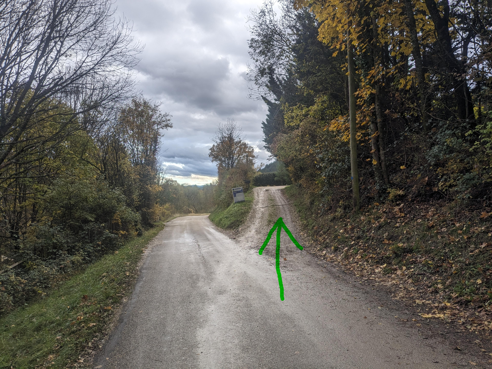
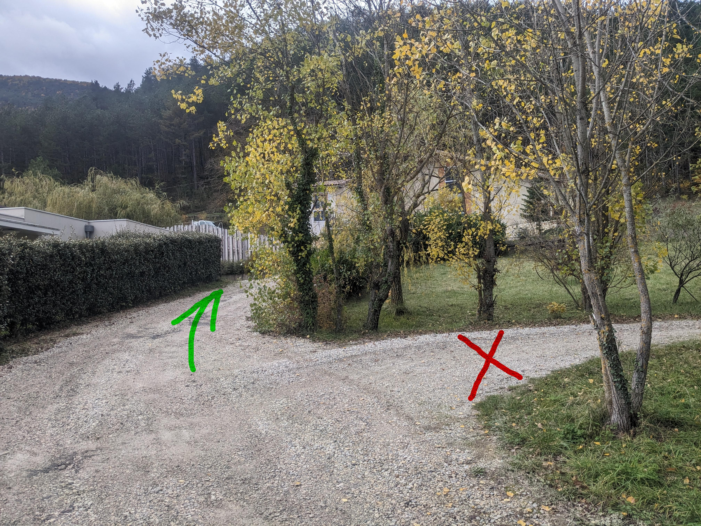

+++
title= "Accès"
breadcrumb= false
menu = false
TOC = false
+++

## Comment arriver

L'adresse:
1050C Route d'Ausson
26150 Die

<iframe src="https://www.google.com/maps/embed?pb=!1m18!1m12!1m3!1d2833.9307298565!2d5.381528899999999!3d44.74143!2m3!1f0!2f0!3f0!3m2!1i1024!2i768!4f13.1!3m3!1m2!1s0x12cab7e847d820ab%3A0xf25909ab5b9f3fb2!2s1050c%20Rte%20d&#39;Ausson%2C%2026150%20Die!5e0!3m2!1sen!2sfr!4v1700039457758!5m2!1sen!2sfr" width="600" height="450" style="border:0;" allowfullscreen="" loading="lazy" referrerpolicy="no-referrer-when-downgrade"></iframe>

Un kilomètre après le pont de la griotte, il y a un chemin qui part vers la droite:

En haut de se chemin il y a une intersection. Ne surtout pas tourner à droite vers les voisins:

## Des places supplémentaires

En dépassant l'intersection et en continuant 50 mètres sur la route, il est possible de se garer sur le côté gauche de la route, sans mettre de roue sur le bitume.

