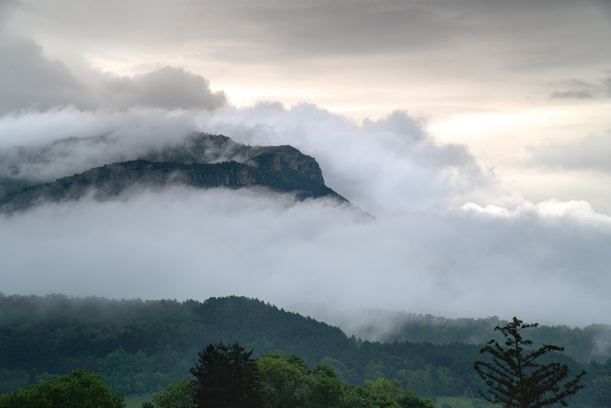

+++
title = "L'exterieur"
+++

Le gîte se trouve au bord d’une parcelle de forêt
Attenante au gîte, et notamment à la chambre “terrasse”, se trouve **la grande terrasse privative** en bois, de 80m². Vous pourrez profiter sereinement de la **vue sur les contreforts du Vercors**, avec une vue imprenable sur le dôme du Glandasse. Si vous cherchez la fraîcheur, vous pourrez profiter d’une **sieste à l’ombre de la forêt, sur une terrasse forestière**. Promenez-vous librement sur notre domaine et laissez-vous émerveiller par les murs en pierre sèche, bâti par nos soins, ainsi que par notre charmant verger, planté avec amour en 2024.

