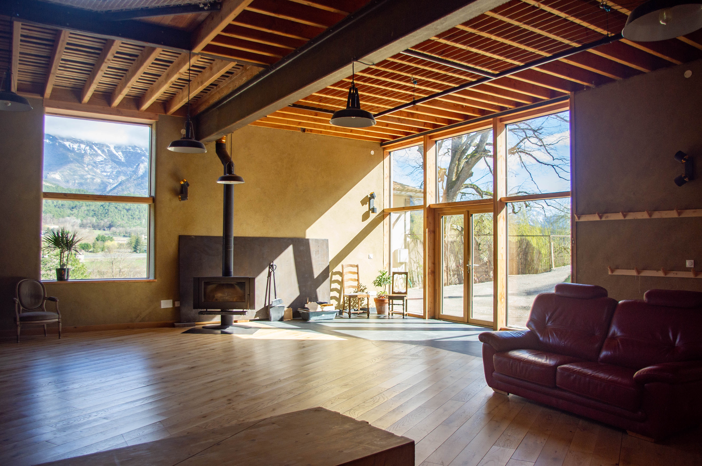
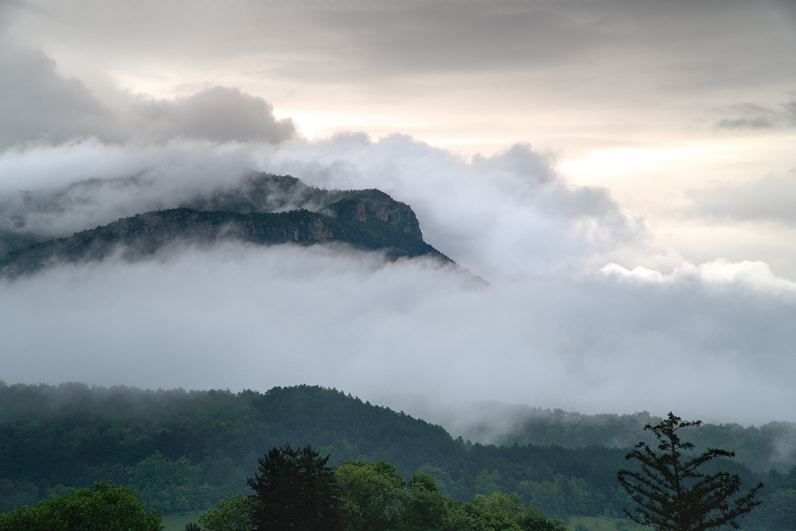

+++
title = "Un gîte de groupe spacieux en bordure de forêt et face au Vercors"
menu = "Le Gîte"
position = 10 
+++

## Une immense sale d'activité
Sur 2 niveaux, retrouvez au rez de chaussée **la Grande pièce de vie de 100m2** avec murs en pierre sèche, mur en pisé, canapé, table basse, et poêle à bois pour l'hiver. Elle peut faire, salon, grande salle de jeu ou d’activité, ou encore salle de bal !
Le gîte est **très bien isolé phoniquement et thermiquement** grâce à son mur en pisé, et ses murs en brique de terre compressée et en terre banchée . Conçu pour être un studio d’enregistrement, les chambres sont bien isolées phoniquement.

## La cuisine collective
En haut vous trouverez une grande **cuisine collective** toute équipée, une salle à manger qui a la particularité d'avoir un grand filet praticable qui donne au-dessus de la Grande pièce de vie, dans lequel vous pourrez faire votre sieste digestive par exemple ! Vous trouverez tout l'équipement dont vous aurez besoin, cafetière, huiles, sel, épices, récipients, poêles et casseroles, grille-pain, bouilloire, congélateur,  micro-onde, four, lave-vaisselle, etc.

## Chambre Terrasse 
1x lit double, avec accès direct à la terrasse

## Chambre Nid
1x lit double 1x lit 1 simple

## Chambre Forêt
1x lit double 1x lit 1 simple

## Chambre Alcove
1x lits double et 4x lit 1 simple

## Chambre Hublot
2x lits simple

## Mezzanine
3x lits simple

## Salle de bain avec baignoire
Une salle de bain à l'étage avec baignoire et douche à l'italienne

## Douche de couple
Au rez de chaussée, une douche avec 2 pomeaux pour prendre sa douche en couple, ou pas !

## Toilettes sèches
Le logement est équipé de **2 toilettes sèches** séparées dont un avec un urinoir, et de **2 salle de bains** dont une avec douche à l'italienne et baignoire.

## La terrasse
Sur la **Grande terrasse privative** en bois de 80m², vous pourrez profiter sereinement de la **vue sur les contreforts du Vercors**, avec une vue imprenable sur le dôme du Glandasse.

## La forêt
Le gîte se trouve au bord d’une parcelle de forêt attenante au gîte,  Si vous cherchez la fraîcheur, vous pourrez profiter d’une **sieste à l’ombre de la forêt, sur une terrasse forestière**. Promenez-vous librement sur notre domaine et laissez-vous émerveiller par les murs en pierre sèche, bâti par nos soins, ainsi que par notre charmant verger, planté avec amour en 2024.

## La rivière
En face de la route, se trouve un acces à la rivière par un chemin dérobé

