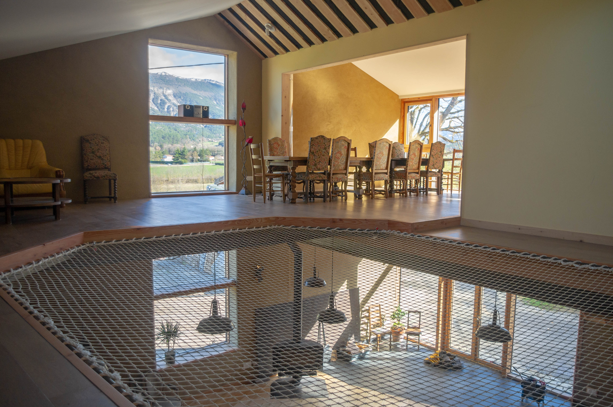

+++
title = "Le Gîte"
+++

Sur 2 niveaux, au rez de chaussée vous trouverez **la Grande pièce de vie de 100m2** avec murs en pierre sèche, mur en pisé, canapé, table basse, et poêle à bois pour l'hiver. Elle peut faire, salon, grande salle de jeu ou d’activité, ou encore salle de bal !

En haut vous trouverez une grande **cuisine collective** toute équipée, une salle à manger qui a la particularité d'avoir un grand filet praticable qui donne au-dessus de la Grande pièce de vie, dans lequel vous pourrez faire votre sieste digestive par exemple !

A l’étage, vous trouverez **5 chambres** dont voici le détail:
>Chambre terrasse : 1x lit double, avec accès direct à la terrasse

>Chambre Nid : 1x lit double 1x lit 1 simple

>Chambre forêt : 1x lit double 1x lit 1 simple

>Chambre alcove : 2x lits double et 1x lit 1 simple

>Chambre au hublot  : 2x lits simple

>Mezzanine au dessus de la cuisine, avec possibilité d’avoir des lits individuels

Le logement est équipé de **2 toilettes sèches** séparées dont un avec un urinoir, et de **2 salle de bains** dont une avec douche à l'italienne et baignoire.

Le gîte est **très bien isolé phoniquement et thermiquement** grâce à son mur en pisé, et ses murs en brique de terre compressée et en terre banchée . Conçu pour être un studio d’enregistrement, les chambres sont bien isolées phoniquement.

Dans la cuisine, il y a tout l'équipement dont vous aurez besoin, cafetière, huiles, sel, épices, récipients, poêles et casseroles, grille-pain, bouilloire, congélateur,  micro-onde, four, lave-vaisselle, etc. A completer.

.jpg)
